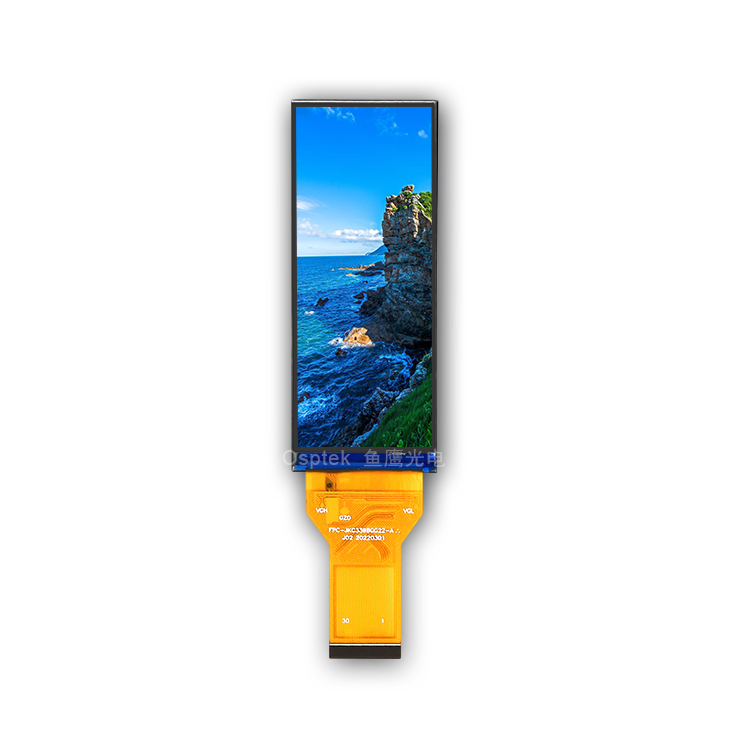

<p align="left"></p>

<h1 align="center">OSPTEK 3.13″ TFT 376×960 (GC9503CV · RGB)</h1>

<p align="center"><b>Bar-style TFT module · RGB · GC9503CV</b></p>

<p align="center"><a href="./README.md">简体中文</a> | English</p>

<p align="center">
  
  
  
  
</p>

<p align="center"></p>

## Contents

- [Overview](#overview)
- [Specifications](#specifications)
- [Sample projects](#sample-projects)
- [Repository layout](#repository-layout)
- [Resources](#resources)
- [Buy](#buy)
- [Support](#support)

---

## Overview

OSPTEK **3.13″ 376×960 TFT** is an **RGB** color display module driven by **GC9503CV**. The tall aspect ratio suits bar-style HMI, side status strips, and vertical info panels.

Spec ID (repository name): `3.13-tft-376x960-rgb-gc9503cv`

The module datasheet filename references **YDP313B002**. Electrical and mechanical details follow the PDFs under [`docs/`](./docs/).

## Specifications

| Item | Spec |
| ---- | ---- |
| Size | 3.13 inch |
| Type | TFT (color) |
| Resolution | 376×960 |
| Interface | RGB |
| Driver IC | GC9503CV |
| Init reference | See init notes under `docs/` |

> Full outline, FPC definition, power, and timing follow the product datasheet / driver IC datasheet.

## Sample projects

| Description | Path |
| ---- | ---- |
| ESP32-S3 · GC9503CV RGB + LVGL adapter | [`examples/esp32s3_gc9503_lvgl_adapter/`](./examples/esp32s3_gc9503_lvgl_adapter/) |

## Repository layout

```text
3.13-tft-376x960-rgb-gc9503cv/
├── README.md
├── README_EN.md
├── LICENSE
├── images/          # README assets
├── docs/            # datasheets, init files
└── examples/        # sample projects
```

## Resources

### Product files

| Resource | Link |
| ---- | ---- |
| Product datasheet (YDP313B002) | [`docs/YDP_313_B002_V1_1a0ff66f58.pdf`](./docs/YDP_313_B002_V1_1a0ff66f58.pdf) |
| Driver IC datasheet (GC9503CV) | [`docs/GC_9503_CV_Data_Sheet_V1_0_1_bf6521995e.pdf`](./docs/GC_9503_CV_Data_Sheet_V1_0_1_bf6521995e.pdf) |
| Init sequence (text) | [`docs/GC9503CV_BOE3.13IPS(QV032DEQ-N80)_20220106_AN_V1.txt`](./docs/GC9503CV_BOE3.13IPS(QV032DEQ-N80)_20220106_AN_V1.txt) |

### Samples

- [ESP32-S3 GC9503CV RGB + LVGL adapter](./examples/esp32s3_gc9503_lvgl_adapter/)

## Buy

<p align="center">
  <a href="https://www.aliexpress.com/store/1105701619"></a>
  &nbsp;&nbsp;
  <a href="https://shop110742373.taobao.com/"></a>
</p>

**Overseas (AliExpress)**

- Store: [OSPTEK Official Store](https://www.aliexpress.com/store/1105701619)

**China (Taobao)**

- Store: [鱼鹰光电工厂店](https://shop110742373.taobao.com/)

## Support

- Technical support / product inquiry: <luyu@osptek.com>
- QQ group (China): **985881096**
- Website: <https://osptek.com/>

---

<p align="center"><sub>© 2026 OSPTEK · Materials in this repository are licensed under CC BY 4.0</sub></p>
